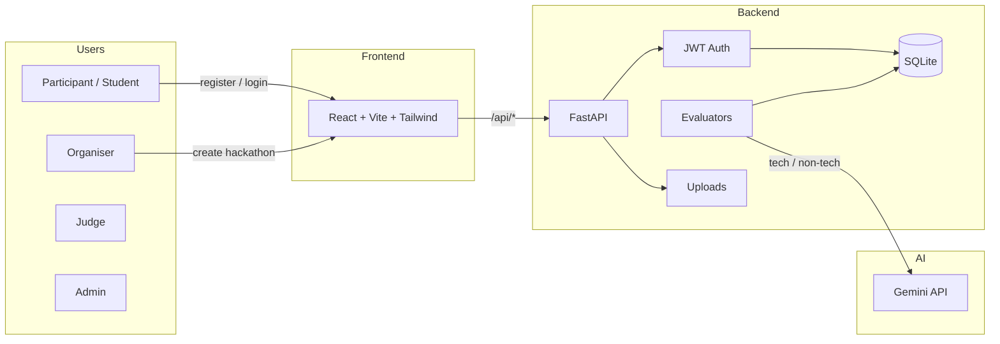
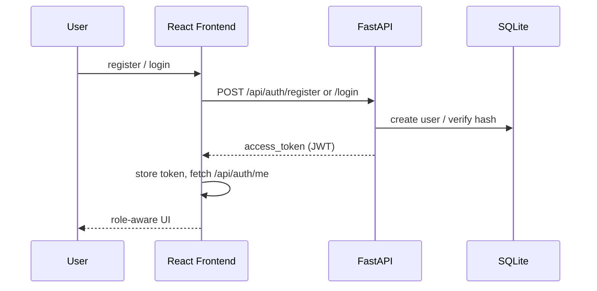
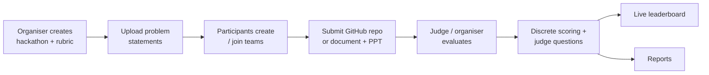
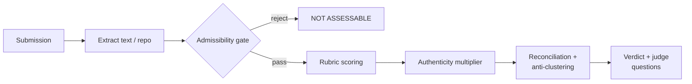

# Hackathon Evaluation Platform

A web app for organising hackathons, collecting project submissions, and evaluating them with AI-powered scoring.

## Features
- User registration and login (JWT).
- Create hackathons and upload problem statements (PDF, DOCX, PPTX, XLSX, TXT, MD).
- Create teams and submit projects per problem statement.
- Two evaluator APIs:
  - **Tech**: evaluates a GitHub repository against a problem statement.
  - **Non-tech**: evaluates a project document, with an optional supporting PPT.
- Hackathon-oriented rubrics with admissibility gate, authenticity multiplier, and server-side score reconciliation.
- Live leaderboard with discrete, non-clustered scores and a public shareable link.
- Organiser/admin reports with verdict and submission-type breakdowns.

## System overview



### Authentication flow



### Hackathon lifecycle



### Evaluation pipeline



### RBAC matrix

| Action | Admin | Organiser | Judge | Participant |
|---|---|---|---|---|
| Create hackathon | ✅ | ✅ | ❌ | ❌ |
| Upload problem statement | ✅ | ✅ | ❌ | ❌ |
| Create / join team | ✅ | ✅ | ✅ | ✅ |
| Submit project | ✅ | ✅ | ✅ | ✅ |
| Evaluate submission | ✅ | ✅ | ✅ | ❌ |
| View reports | ✅ | ✅ | ❌ | ❌ |
| View public leaderboard | ✅ | ✅ | ✅ | ✅ |

## Tech stack
- **Backend**: FastAPI, SQLAlchemy, SQLite, Pydantic.
- **Frontend**: React + TypeScript + Vite + Tailwind CSS.
- **LLM**: Google Gemini REST API (`GEMINI_API_KEY`, `GEMINI_MODEL`) with automatic model fallbacks. If no key is set, a deterministic fallback evaluator is used for demo/testing.

## Quick start

### 1. Backend
```bash
cd backend
python -m venv venv
venv\Scripts\activate
pip install -r requirements.txt
cp .env.example .env   # edit with your secret key / LLM endpoint
uvicorn app.main:app --reload --port 8002
```

### 2. Frontend
```bash
cd frontend
npm install
npm run dev
```

Open [http://localhost:5173](http://localhost:5173) and log in.

## Environment variables
Create `backend/.env` from `.env.example`:

| Variable | Description |
|----------|-------------|
| `DATABASE_URL` | SQLite path (default: `sqlite:///./hackathon.db`) |
| `SECRET_KEY` | JWT signing secret |
| `GEMINI_API_KEY` | Google Gemini API key (starts with `AIza...`). Optional — if absent, a deterministic fallback evaluator is used. |
| `GEMINI_MODEL` | Gemini model to use. Default: `gemini-3.5-flash-lite`. Fallbacks include `gemini-flash-latest`, `gemini-3.5-flash`, `gemini-3.7-flash`. |
| `GITHUB_TOKEN` | Optional: higher GitHub API rate limits. Public repos work without it. |
| `UPLOAD_DIR` | Directory for uploaded files (default: `uploads`) |
| `MAX_UPLOAD_SIZE` | Max upload bytes (default: 20 MB) |
| `AI_BACKEND_URL` | Optional legacy LLM endpoint fallback. |
| `AI_BACKEND_TOKEN` | Optional Bearer token for the legacy LLM endpoint. |

## API overview

FastAPI auto-generated docs: [http://localhost:8000/docs](http://localhost:8000/docs)

Key endpoints:
- `POST /api/auth/register` — create account (Student or Organiser only)
- `POST /api/auth/login` — get JWT token
- `GET /api/auth/admin/users` — admin user list
- `PUT /api/auth/users/{id}/role` — admin role update
- `POST /api/hackathons` — create hackathon (organiser/admin)
- `POST /api/hackathons/{id}/problem-statements` — upload problem statement (organiser/admin)
- `POST /api/teams` — create team
- `POST /api/teams/{id}/join` — join a team
- `POST /api/submissions` — submit a project
- `POST /api/evaluate/tech/{submission_id}` — evaluate a tech submission (judge/organiser/admin)
- `POST /api/evaluate/non-tech/{submission_id}` — evaluate a non-tech submission (judge/organiser/admin)
- `POST /api/evaluate/tech/{id}/retry` — retry tech evaluation
- `POST /api/evaluate/non-tech/{id}/retry` — retry non-tech evaluation
- `GET /api/leaderboard/{hackathon_id}` — authenticated leaderboard
- `GET /api/leaderboard/public/{hackathon_id}` — public shareable leaderboard
- `GET /api/reports` — list reports for organisers/admins
- `GET /api/reports/{hackathon_id}` — detailed hackathon report

## Evaluation details

Both evaluators return a score out of 1000 and a verdict:
- **850–1000**: OUTSTANDING
- **700–849**: EXCELLENT
- **500–699**: SATISFACTORY
- **0–499**: NEEDS WORK
- Gate reject: NOT ASSESSABLE

Tech rubric (8 categories):
1. Problem Understanding (150)
2. Implementation Completeness (200)
3. Code Quality & Architecture (150)
4. Innovation & Creativity (150)
5. Technical Feasibility (100)
6. Documentation (100)
7. Commit Authenticity / Effort (100)
8. Presentation / Demo (50)

Non-tech rubric (7 categories):
1. Problem-Specific Grounding (150)
2. Solution Effectiveness (200)
3. Research & Evidence (150)
4. Feasibility & Practicality (150)
5. Communication & Clarity (100)
6. Innovation & Creativity (150)
7. Presentation Quality (100)

The final score is the raw LLM score multiplied by an authenticity band (`HIGH_HUMAN_INPUT`, `MIXED`, `PREDOMINANTLY_ASSISTED`, `NO_DISCERNIBLE_HUMAN_INPUT`). The reconciliation step then applies a small deterministic jitter so that no two teams in the same hackathon end up with the exact same score, preserving ordering and verdict bands.

## Running tests

```bash
cd backend
venv\Scripts\pytest tests -v
```

The test suite covers auth, hackathons, problem statements, teams, submissions, tech/non-tech evaluation, and the discrete leaderboard.

## Running the validation harness

A browserless full-stack flow test is included at the repo root:

```bash
cd backend
venv\Scripts\activate
venv\Scripts\python ../validate_flow.py
```

It starts the backend and Vite dev server, verifies the frontend loads, then walks through:
register → login → create hackathon → upload problem statement → create team → submit tech repo → evaluate tech → create second team → submit non-tech document → evaluate non-tech → view leaderboard.

## Production notes
- The default storage is local filesystem. For production, replace `app/services/file_storage.py` with S3-compatible storage.
- Set a strong `SECRET_KEY` and configure the LLM endpoint for real evaluations.
- Use a production database (PostgreSQL) by changing `DATABASE_URL`.
